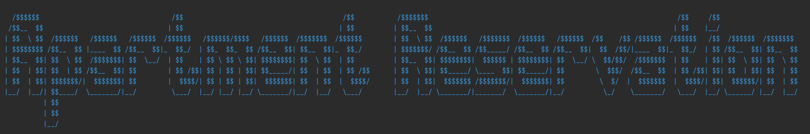

# Webler Java Backend course final project (teamwork)

## Backend Dependencies

- Java Development Kit - JDK 21 (Oracle openjdk-21)
- Spring Boot 3
- Spring Framework 6
- Maven
- MySQL Connector
- Spring Data JPA
- Spring Web
- Spring DevTools
- Lombok
- Model-mapper

## Frontend Dependencies

- Spring Thymeleaf
- Bootstrap 5

## Database Dependencies

- MySQL 8.0.34
- MySQL Workbench 8.0.34

## Test Dependencies

- JUnit 5
- Mockito
- JUnit Jupiter
- Spring Boot Test
- Spring Boot Starter Test
- H2 Database (in-memory database)